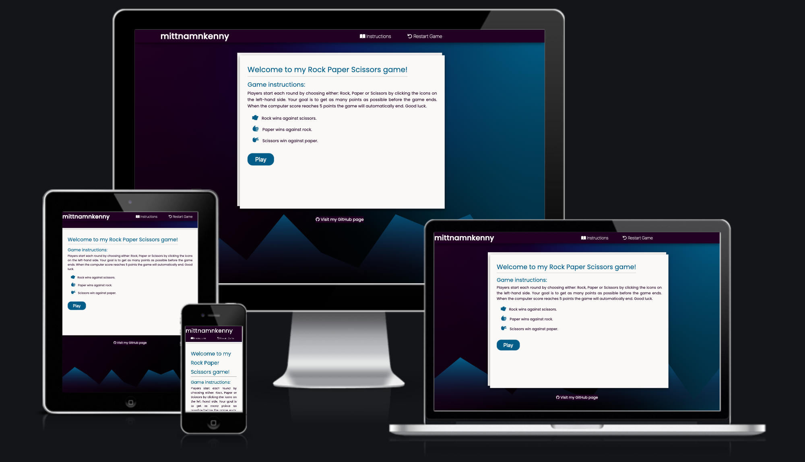

# My Rock Paper Scissors game

For the second milestone assignment with Code Institute, I have created a classic Rock Paper Scissors game. This game is single player only, where the user will try to get as many points as possible before the computer score reaches 5 points.
The user will choose one of the three choices and try to beat the computer; the chance is random.

The rules remain the same as the original game: Rock beats scissors. Scissors beat paper, and paper beats rock. The rules are easy; the game is both simple and fun.

This site is targeted toward people who have an interest in both gaming and JavaScript.

[View the live project here.](https://mittnamnkenny.github.io/rock-paper-scissors/)

